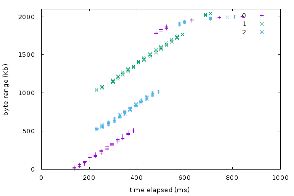
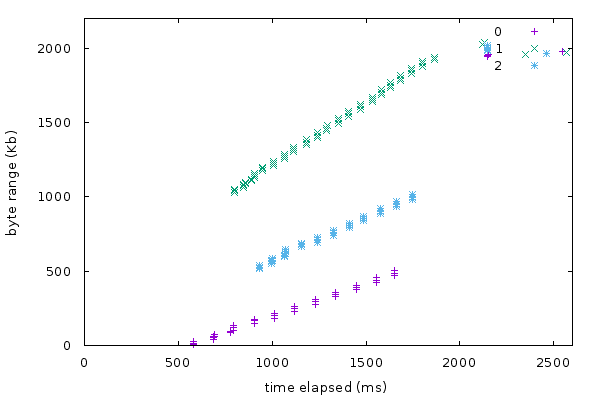
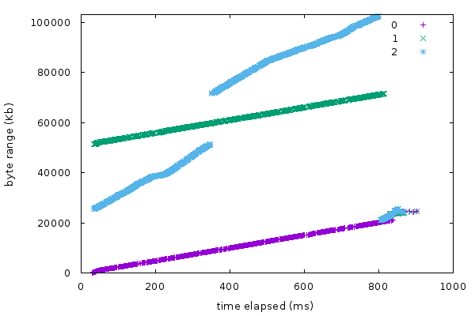
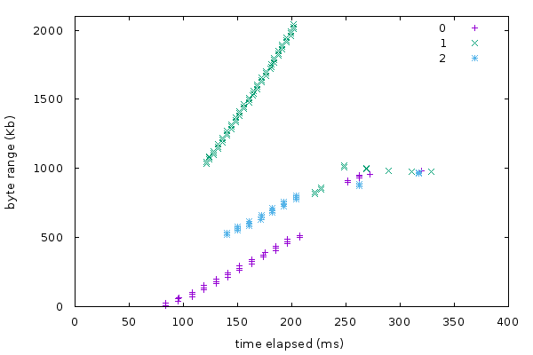

# Computer Networks Lab3

1700012751

Jing Mai


## Writing Task (30%)

>  How do you estimate the bandwidth and the delay of a path? 

My implementation estimate the bandwidth by sampling the data size consumed each time and their time intervals, counting the bandwidth in the latest time interval and smoothing the estimated bandwidth by weighted mean. To specify, the sampling happens in `lib/common/rangeclient.c:on_body`.

As for delay, we could make use of the [Ping Frame](https://http2.github.io/http2-spec/) in *HTTP2* specification. `lib/common/http2client.c` has provided us with the prototype callback  function `handle_ping_frame`. To handing the received ping frame, We just need to register this callback function in `lib/common/htttp2client.c:setup_steam`. Moreover, in order to send a ping frame periodically, we could register a timer under the event-driving loop in `lib/common/http2client.c:h2o_httpclient__h2_on_connect`.

>  How do you assign jobs to the three paths? 

In my implementation, the main routine of rescheduling is summarized as following:

- find one idle path
- find the path with the longest estimated remaining time(based on the bandwidth and delay we have calculated) in the other two paths
- reschedule these two path according to their bandwidth ratio. If the bandwidth of either one is unknown, just reschedule these two paths averagely. 

>  What features (pipelining, eliminating tail byes, etc.) do you implement? And how do you implement them? You are encouraged to write down other design aspects of your implementation. 

I implement http pipelining. For a http connection, when the size of remaining unreceived data is less than or equal to that of the receiveid data in the latest frame, we could assert that this http connection is going to complete soon. At this moment, we could reschedule this path in advance, instead of rescheduling when this connection is eventually closed. Pipelining make senses especially under the condition of high latency.


## Drawing Task (40%)

The network topology is defined the same as that in the wirteup.

```yaml

3
0 1 10.100.1
0 2 10.100.2
0 3 10.100.3
```


1. under static network conditions

I use `Mahimahi` to simulate the static network conditions. Each network interface have *20ms* delay.

 

2. under varying bandwidth conditions (you can use the [traces](https://github.com/ravinet/mahimahi/tree/master/traces) provided by `Mahimahi`)

   What annoys me is that some `Mahimahi` commands like `mm-link` seem to have bugs in my system platform.

   ```bash
   $ mm-delay 20 mm-link --meter-all /usr/share/mahimahi/traces/Verizon-LTE-short.up /usr/share/mahimahi/traces/Verizon-LTE-short.down
   Died on std::runtime_error: xcb_get_setup: returned null pointer
   Died on std::runtime_error: xcb_get_setup: returned null pointer
   Died on std::runtime_error: `downlink': process exited with failure status 1
   Died on std::runtime_error: `mm-link --meter-all /usr/share/mahimahi/traces/Verizon-LTE-short.up /usr/share/mahimahi/traces/Verizon-LTE-short.down': process exited with failure status 1
   Died on std::runtime_error: `packetshell': process exited with failure status
   ```

   Then I tried to use `tc` to simulate changeable network conditions as following:

   ```bash
   sudo tc qdisc add dev veth0-1 root netem delay 100ms 10ms 30%
   sudo tc qdisc add dev veth0-2 root netem delay 50ms 10ms 30%
   sudo tc qdisc add dev veth0-3 root netem delay 75ms 10ms 30%
   ```

   

3. with a high-bandwidth path and two low-bandwidth paths

   network configuration:

   ```bash
   sudo tc qdisc add dev veth0-1 root tbf rate 1mbit burst 32kbit latency 50ms
   sudo tc qdisc add dev veth0-2 root tbf rate 1mbit burst 32kbit latency 50ms
   sudo tc qdisc add dev veth0-3 root tbf rate 10mbit burst 32kbit latency 50ms
   ```

   

4. with a short-delay path and two long-delay paths

   network configuration:

   ```bash
   sudo tc qdisc add dev veth0-1 root netem delay 10ms
   sudo tc qdisc add dev veth0-2 root netem delay 3ms
   sudo tc qdisc add dev veth0-3 root netem delay 10ms
   ```

   

